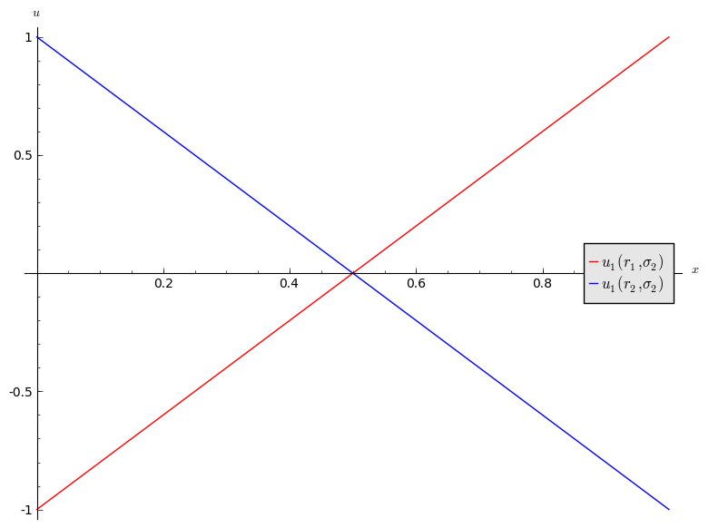
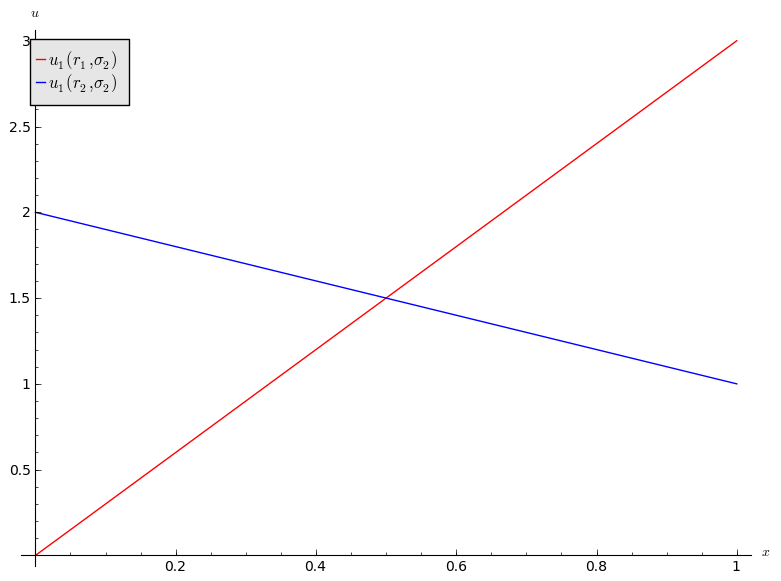
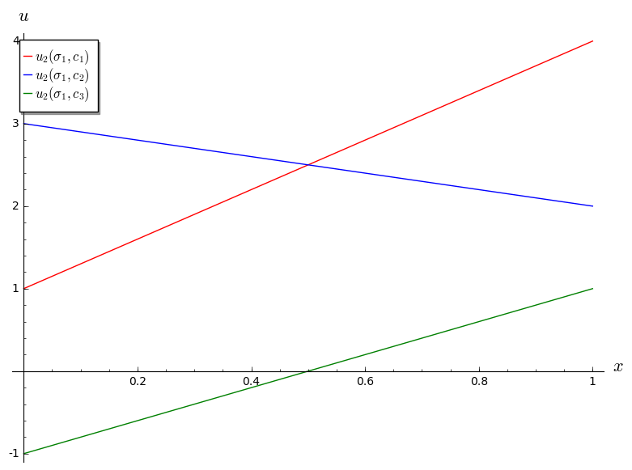

## Recap

In the [previous chapter]({{site.baseurl}}/Content/Chapter_03-Dominance) we discussed:

- Predicting rational behaviour using dominated strategies;
- The CKR;

We did discover certain games that did not have any dominated strategies.

## Best response functions

### Definition of a best response

---

In an \\(N\\) player normal form game. A strategy \\(s^\*\\) for player \\(i\\) is a best response to some strategy profile \\(s_{-i}\\) if and only if \\(u_i(s^\*,s\_{-i})\geq u\_{i}(s,s\_{-i})\\) for all \\(s\in S_i\\).

---

We can now start to predict rational outcomes in pure strategies by identifying all best responses to a strategy.

$$\begin{pmatrix}
(1,3)&(4,2)&(2,2)\\
(4,0)&(0,3)&(4,1)\\
(2,5)&(3,4)&(5,6)
\end{pmatrix}
$$

We will underline the best responses for each strategy giving (\\(r_i\\) is underlined if it is a best response to \\(s_j\\) and vice versa):

$$\begin{pmatrix}
(1,\underline{3})&(\underline{4},2)&(2,2)\\
(\underline{4},0)&(0,\underline{3})&(4,1)\\
(2,5)&(3,4)&(\underline{5},\underline{6})
\end{pmatrix}
$$

We see that \\((r_1,s_1)\\) represented a pair of best responses. What can we say about the long term behaviour of this game?

## Best responses against mixed strategies

We can identify best responses against mixed strategies. Let us take a look at the matching pennies game:

$$\begin{pmatrix}
(1,-1)&(-1,1)\\
(-1,1)&(1,-1)
\end{pmatrix}$$

If we assume that player 2 plays a mixed strategy \\(\sigma_2=(x,1-x)\\) we have:

$$u_1(r_1,\sigma_2)=2x-1$$

and

$$u_1(r_2,\sigma_2)=1-2x$$

We see that:

1. If \\(x<1/2\\) then \\(r_2\\) is a best response for player 1.
2. If \\(x>1/2\\) then \\(r_1\\) is a best response for player 1.
3. If \\(x=1/2\\) then player 1 is indifferent.

Let us repeat this exercise for the battle of the sexes game.

$$\begin{pmatrix}
(3,2)&(0,0)\\
(1,1)&(2,3)
\end{pmatrix}$$

If we assume that player 2 plays a mixed strategy \\(\sigma_2=(x,1-x)\\) we have:

$$u_1(r_1,\sigma_2)=3x$$

and

$$u_1(r_2,\sigma_2)=2-x$$

We see that:

1. If \\(x<1/2\\) then \\(r_2\\) is a best response for player 1.
2. If \\(x>1/2\\) then \\(r_1\\) is a best response for player 1.
3. If \\(x=1/2\\) then player 1 is indifferent.

## Connection between best responses and dominance

### Definition of the undominated strategy set

---

In an \\(N\\) player normal form game, let us define the undominated strategy set \\(UD_i\\):

$$UD_i=\{s\in S_i\;|\; \text{s is not strictly dominated}\}$$

---

If we consider the following game:

$$\begin{pmatrix}
(3,3)&(7,2)&(5,1)\\
(5,1)&(6,3)&(7,-1)
\end{pmatrix}$$

We have:

$$UD_1=\{r_1,r_2\}$$
$$UD_2=\{s_1,s_2\}$$

### Definition of the best responses strategy set

---

In an \\(N\\) player normal form game, let us define the best responses strategy set \\(B_i\\):

$$B_i=\{s\in S_i\;|\; \exists\;\sigma\in\Delta S_{-i}\text{ such that }s \text{ is a best response to }\sigma\}$$

---

In other words \\(B_i\\) is the set of functions that are best responses to some strategy profile in \\(S_{-i}\\).

Let us try to identify \\(B_2\\) for the above game. Let us assume that player 1 plays \\(\sigma_1=(x,1-x)\\). This gives:

$$u_2(\sigma_1,s_1)=1+2x$$
$$u_2(\sigma_1,s_2)=3-x$$
$$u_2(\sigma_1,s_3)=2x-1$$

Plotted:

We see that \\(s_3\\) is never a best response for player 2:

$$B_2=\{s_1,s_2\}$$

We will now attempt to identify \\(B_1\\) for the above game. Let us assume that player two plays \\(\sigma_2=(x,y,1-x-y)\\). This gives:

$$u_1(r_1,\sigma_2)=xu_1(r_1,s_1)+yu_1(r_1,s_2)+(1-x-y)u_1(r_1,s_3)=3x+7y+5-5y-5x$$
$$u_1(r_2,\sigma_2)=xu_1(r_2,s_1)+yu_1(r_2,s_2)+(1-x-y)u_1(r_2,s_3)=5x+6y+7-7y-7x$$

$$u_1(r_1,\sigma_2)-u_2(r_2,\sigma_2)=3y - 2$$

If we can find values of \\(y\\) that give valid \\(\sigma_2=(x,y,1-x-y)\\) and that make the above difference both positive and negative then:

$$B_1=\{r_1,r_2\}$$

\\(y=1\\) gives \\(u_1(r_1,\sigma_2)-u_2(r_2,\sigma_2)=1>0\\) (thus \\(r_1\\) is best response to \\(\sigma_2=(0,1,0)\\)).
Similarly, \\(y=0\\) gives \\(u_1(r_1,\sigma_2)-u_2(r_2,\sigma_2)=-2<0\\) (thus \\(r_2\\) is best response to \\(\sigma_2=(x,0,1-x)\\) for any \\(0\leq x \leq 1\\)) as required.

We have seen in our example that \\(B_i=UD_i\\). This leads us to two Theorems (the proofs are omitted).

### Theorem of equality in 2 player games

---

In a 2 player normal form game \\(B_i=UD_i\\) for all \\(i\in\{1,2\}\\).

---

This is however not always the case:

### Theorem of inclusion in \\(N\\) player games

---

In an \\(N\\) player normal form game \\(B_i\subseteq UD_i\\) for all \\(1 \leq i\leq n\\).

---
