# OR 3: Lecture 7 - Extensive form games and backwards induction

## Recap

In the [previous chapter](Chapter_06-Nash_Equilibria_in_mixed_strategies.pdf)

- We completed our look at normal form games;
- Investigated using best responses to identify Nash equilibria in mixed strategies;
- Proved the Equality of Payoffs theorem which allows us to compute the Nash equilibria for a game.

In this Chapter we start to look at extensive form games in more detail.

## Extensive form games

If we recall Chapter 1 we have seen how to represent extensive form games as a tree:

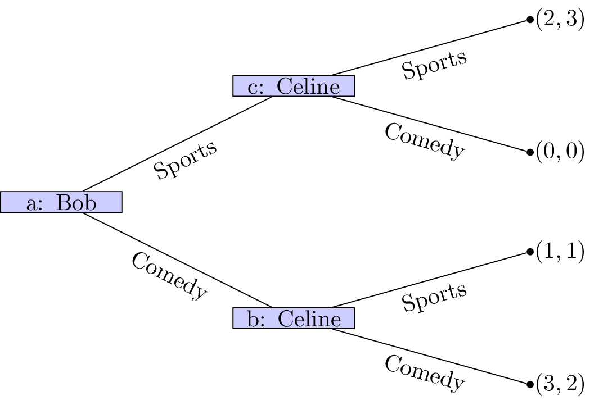

We will not consider the rules that define an extensive form game game tree:

1. Every node is a successor of the (unique) initial node.

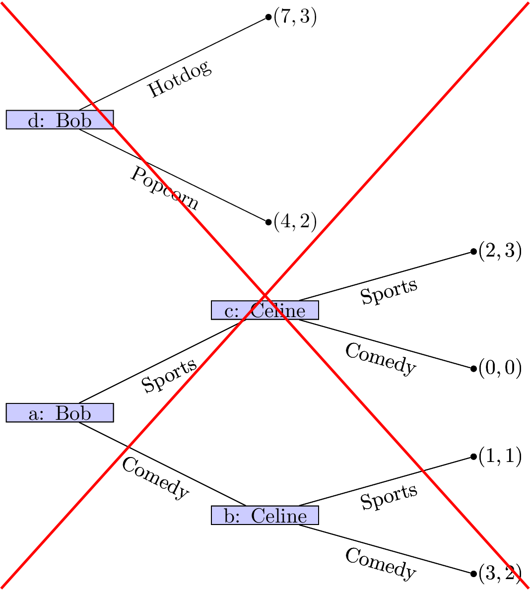

2. Every node apart from the initial node has exactly one predecessor. The initial node has no predecessor.

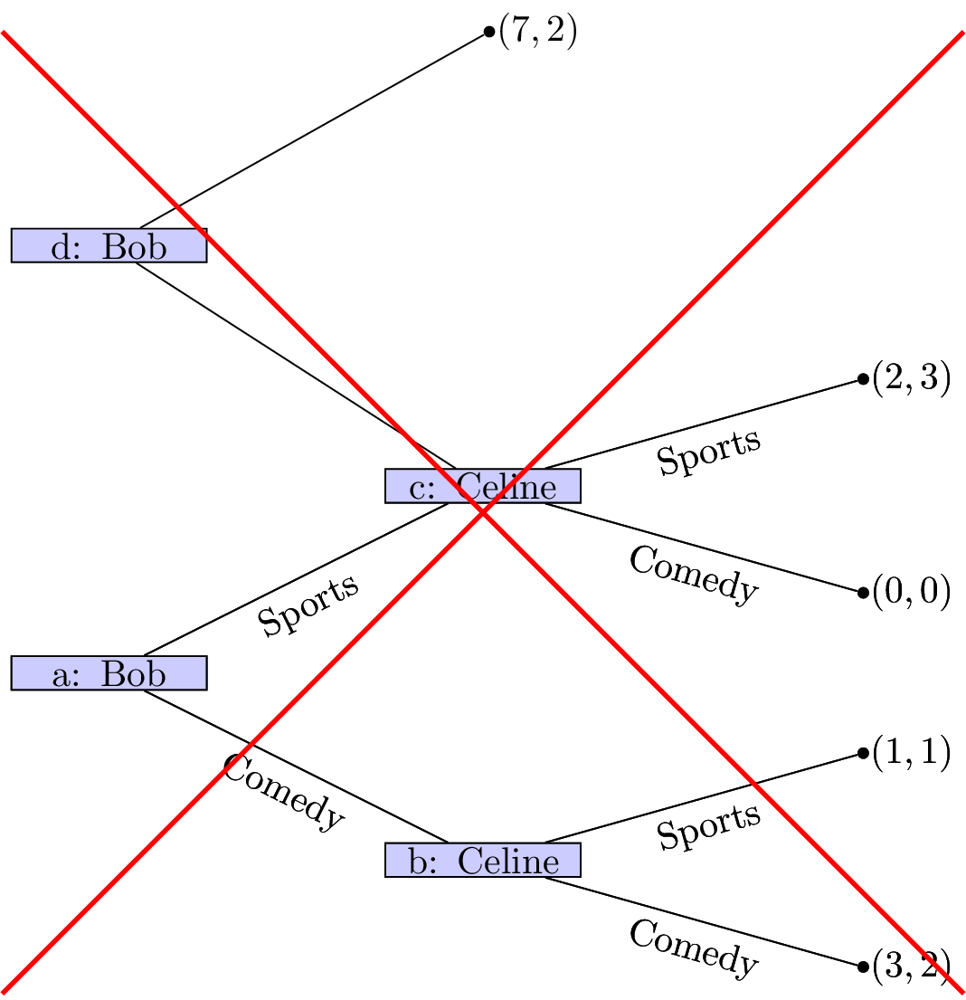

3. All edges extending from the same node have different action labels.

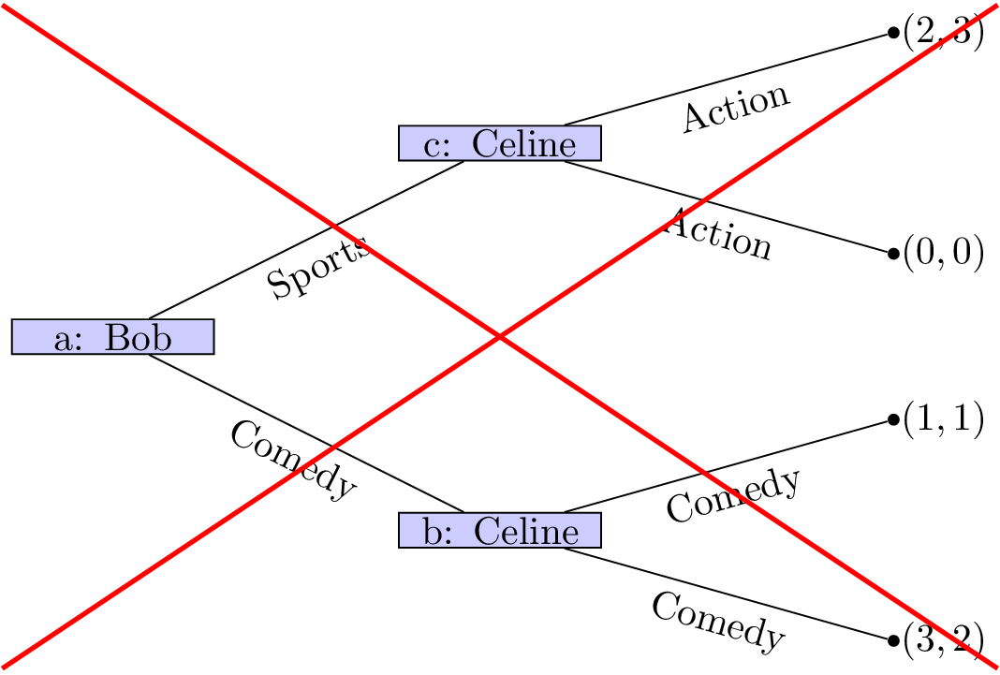

4. Each information set contains decision nodes for one player.

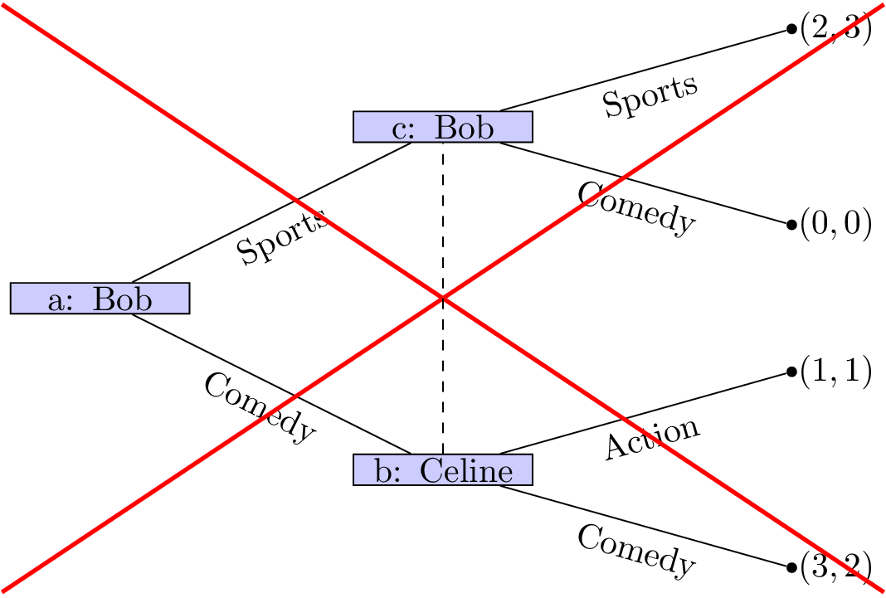

5. All nodes in a given information set must have the same number of successors (with the same action labels on the corresponding edges).

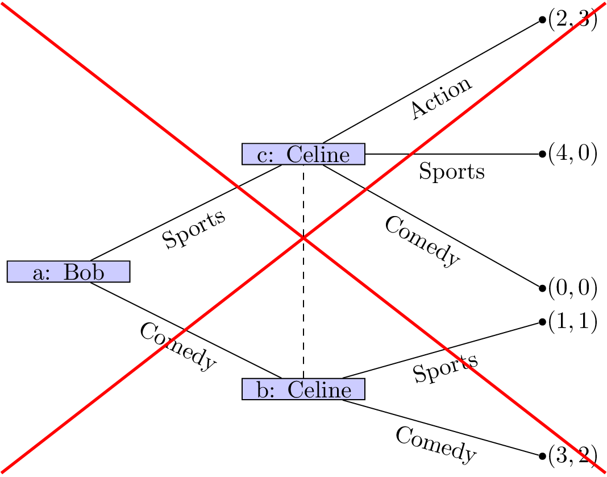

6. We will only consider games with "perfect recall", ie we assume that players remember their own past actions as well as other past events.

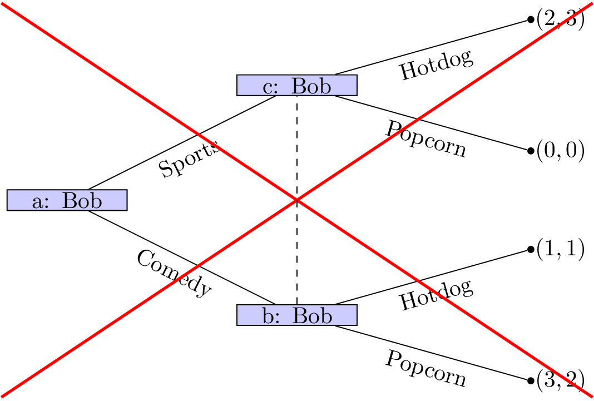

7. If a player's action is not a discrete set we can represent this as follows:

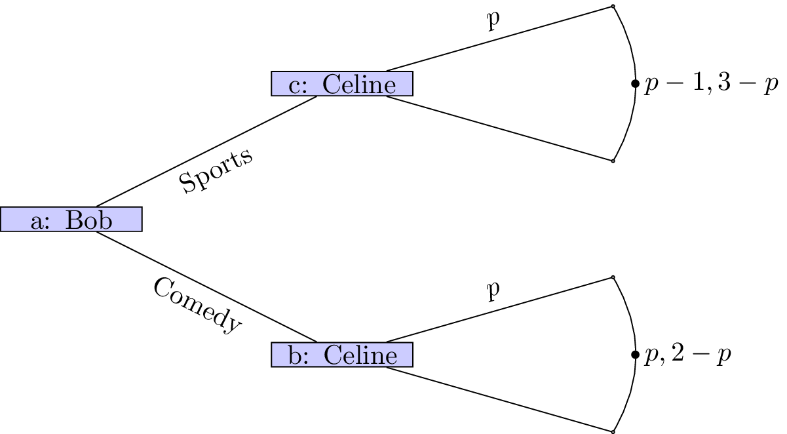

As an example consider the following game (sometimes referred to as "ultimatum bargaining"):

> Consider two individuals: a seller and a buyer. A seller can set a price $p$ for a particular object that has value $K$ to the buyer and no value to the seller. Once the sellers sets the price the buyer can choose whether or not to pay the price. If the buyer chooses to not pay the price then both players get a payoff of 0.

We can represent this as follows:

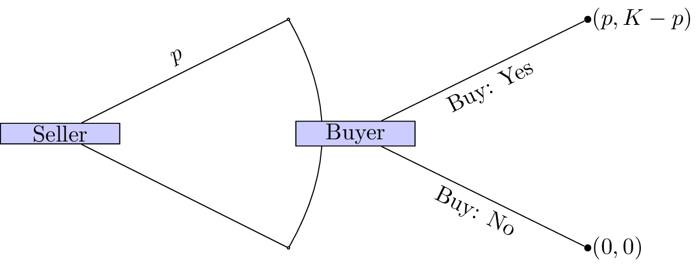

How we can we analyse normal form games?

## Backwards induction

To analyse such games we assume that players not only attempt to optimize their overall utility but optimize their utility conditional on any information set.

### Definition

---

**Sequential rationality:** An optimal strategy for a player should maximise that player's expected payoff, conditional on every information set at which that player has a decision.

---

With this notion in mind we can now define an analysis technique for extensive form games:

---

**Backward induction:** This is the process of analysing a game from back to front. At each information set we remove strategies that are dominated.

---

### Example

Let us consider the following game:

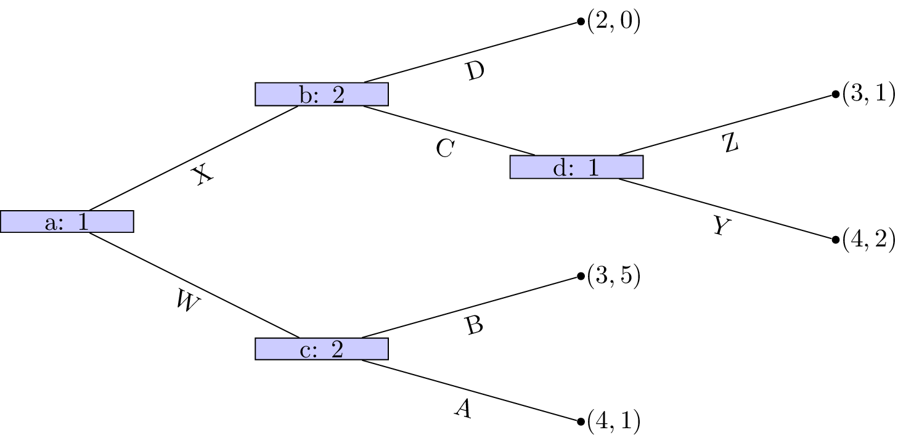

We see that at node $(d)$ that Z is a dominated strategy. So that the game reduces to:

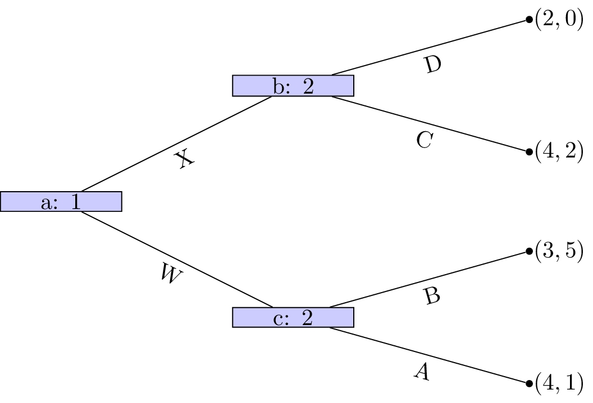

Player 1s strategy profile is (Y). At node $(c)$ A is a dominated strategy so that the game reduces to:

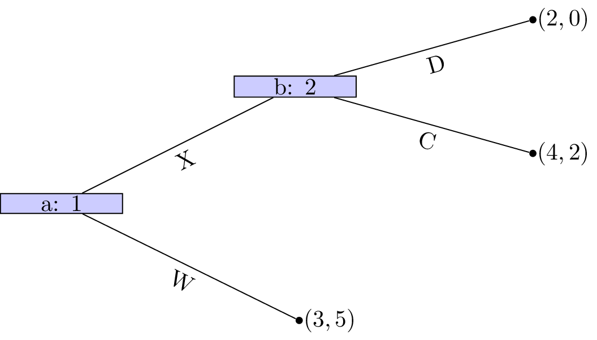

Player 2s strategy profile is (B). At node $(b)$ C is a dominated strategy so that the game reduces to:

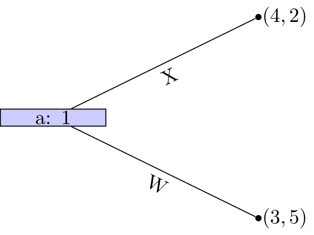

Player 2s strategy profile is thus (C,B) and finally strategy W is dominated for player 1 whose strategy profile is (W,Z).

**This outcome is in fact a Nash equilibria!** Recalling the original tree neither player has an incentive to move.

### Theorem

---

Every finite game with perfect information has a Nash equilibrium in pure strategies. Backward induction identifies an equilibrium.

---

### Proof

---

Recalling the properties of **sequential rationality** we see that no player will have an incentive to deviate from the strategy profile found through backward induction. Secondly ever finite game with perfect information can be solved using backward inductions which gives the result.

---

## Stackelberg game

Let us consider the Cournot duopoly game of Chapter 5. Recall:

> Suppose that two firms 1 and 2 produce an identical good (ie consumers do not care who makes the good). The firms decide at the same time to produce a certain quantity of goods: $q_1,q_2\geq 0$. All of the good is sold but the price depends on the number of goods:

>$$p=K-q_1-q_2$$

> We also assume that the firms both pay a production cost of $k$ per bricks.

However we will modify this to assume that there is a leader and a follower, ie **the firms do not decide at the same time**. This game is called a Stackelberg leader follower game.

Let us represent this as a normal form game:

We use backward induction to identify the Nash equilibria. The dominant strategy for the follower is:

$$q_2^*(q_1)=\frac{K-k-q_1}{2}$$

The game thus reduces to:

The leader thus needs to maximise:

$$u_1(q_1)=(K-q_1-\frac{K-k-q_1}{2})q_1-kq_1=(\frac{K-q_1+k}{2})q_1-kq_1$$

Differentiating and equating to 0 gives:

$$q_1^*=\frac{K-k}{2}$$
which in turn gives:
$$q_2^*=\frac{K-k}{4}$$

The total amount of goods produced is $\frac{3(K-k)}{4}$ whereas in the Cournot game the total amount of good produced was $\frac{2(K-k)}{3}$. Thus more goods are produced in the Stackelberg game, as an exercise what is the difference in profits made by each firm?
