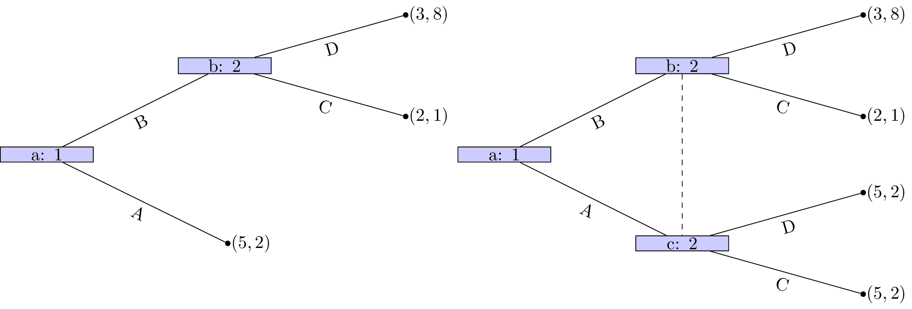
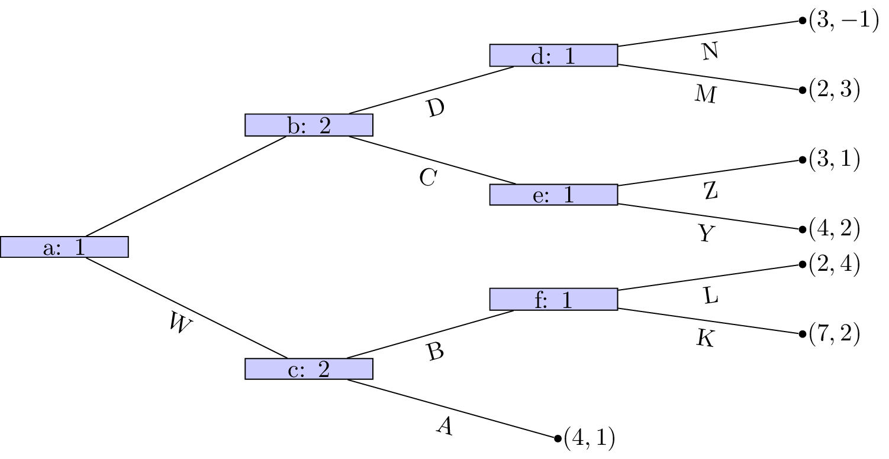
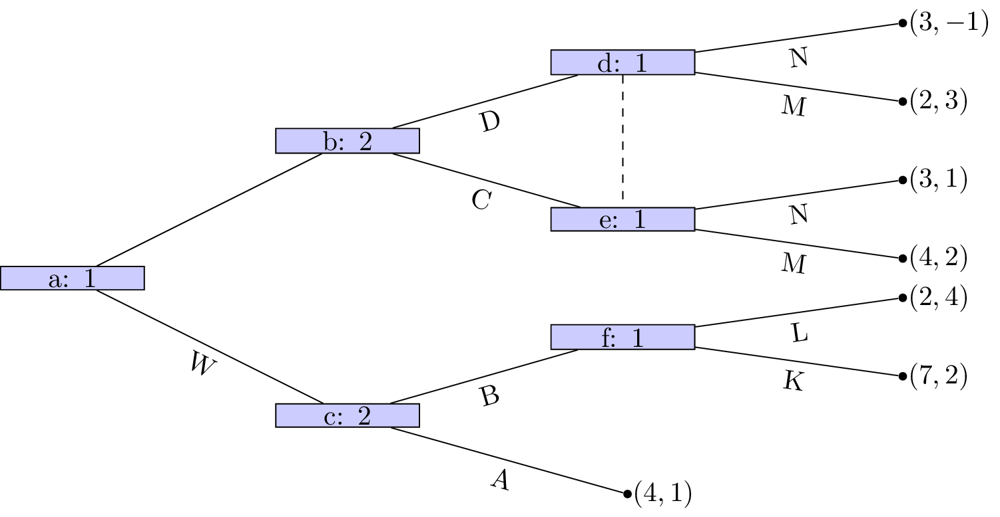
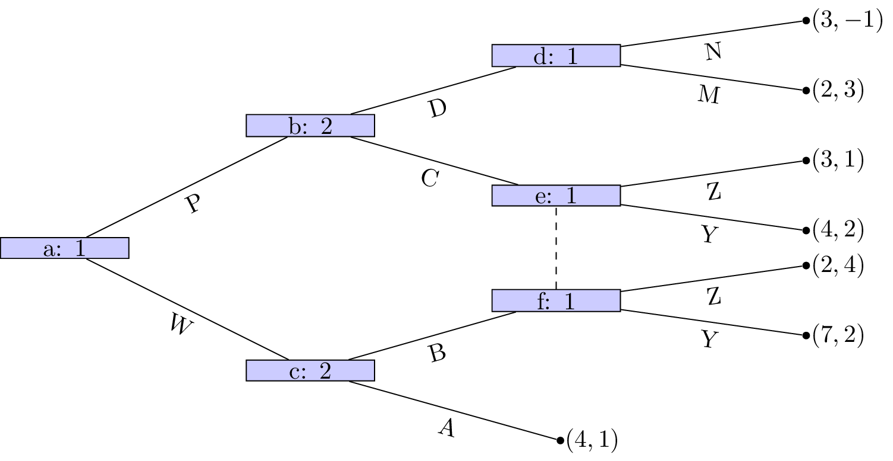
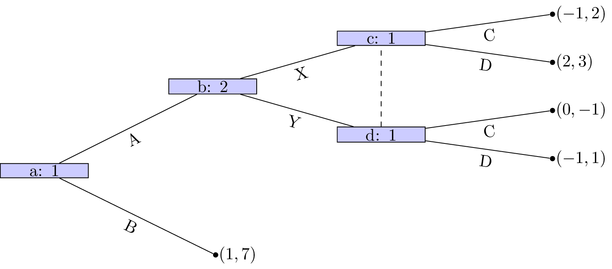

# OR 3: Lecture 8 - Subgame Perfection

## Recap

In the [previous chapter](Chapter_07-Extensive_form_games_and_backwards_induction.md)

- We took a formal look at extensive form games;
- Investigated an analysis technique for extensive form games called backwards induction.

In this Chapter we will take a look at another important aspect of extensive form games.

## Connection between extensive and normal form games

It should be relatively straightforward to see that we can represent any extensive form game in normal form. The strategies in the normal form game simply correspond to all possible combinations of strategies at each level corresponding to each player. \text{Consider the game shown in Figure \ref{L07-img09}.}

We have:

$$S_1=\{\text{XY},\text{XZ},\text{WY},\text{WZ}\}$$
and
$$S_2=\{\text{DA},\text{DB},\text{CA},\text{CB}\}$$

the corresponding normal form game is given as:

$$\begin{pmatrix}
(2,0)&(2,0)&(4,2)&(4,2)\\
(2,0)&(2,0)&(3,1)&(3,1)\\
(4,1)&(3,5)&(4,1)&(3,5)\\
(4,1)&(3,5)&(4,1)&(3,5)
\end{pmatrix}$$

**Note!** There is always a unique normal form representation of an extensive form game (ignoring ordering of strategies) however the opposite is not true. The following game:

$$\begin{pmatrix}
(3,8)&(2,1)\\
(5,2)&(5,2)
\end{pmatrix}$$

has the two extensive form game representations shown\text{ in Figure \ref{L08-img04}}.

## Subgames

### Definition of a subgame

---

In an extensive form game, a node $x$ is said to **initiate a subgame** if and only if $x$ and all successors of $x$ are in information sets containing only successors of $x$.

---

A game where all nodes initiate a subgame is shown\text{ in Figure \ref{L08-img01}}.

A game **that does not have perfect information** nodes $c$, $f$ and $b$ initiate subgames but all of $b$'s successors do not is shown\text{ in Figure \ref{L08-img02}}.

Similarly, in the game shown\text{ in Figure \ref{L08-img03}} the only node that initiates a subgame is $d$.

## Subgame perfect equilibria

We have identified how to obtain Nash equilibria in extensive form games. We now give a refinement of this:

### Definition of subgame perfect equilibrium

---

A subgame perfect Nash equilibrium is a Nash equilibrium in which the strategy profiles specify Nash equilibria for every subgame of the game.

---

**Note that this includes subgames that might not be reached during play!**

Let us consider the example shown\text{ in Figure \ref{L08-img05}}.

Let us build the corresponding normal form game:

$$S_1=\{AC,AD,BC,BD\}$$
and
$$S_2=\{X,Y\}$$

using the above ordering we have:

$$\begin{pmatrix}
(-1,2)&(0,-1)\\
(2,3)&(-1,1)\\
(1,7)&(1,7)\\
(1,7)&(1,7)
\end{pmatrix}$$

The Nash equilibria for the above game (easily found by inspecting best responses) are:

$$\{(AD,X),(BC,Y),(BD,Y)\}$$

If we take a look at the normal form game representation of the subgame initiated at node b with strategy sets:

$$S_1=\{C,D\}\text{ and }S_2=\{X,Y\}$$

we have:

$$\begin{pmatrix}
(-1,2)&(0,-1)\\
(2,3)&(-1,1)
\end{pmatrix}$$

We see that the (unique) Nash equilibria for the above game is $(D,X)$. Thus the only subgame perfect equilibria of the *entire* game is $\{AD,X\}$.

Some comments:

- Hopefully it is clear that *subgame perfect Nash equilibrium* is a _refinement_ of Nash equilibrium.
- In games with perfect information, the Nash equilibrium obtained through backwards induction is subgame perfect.
