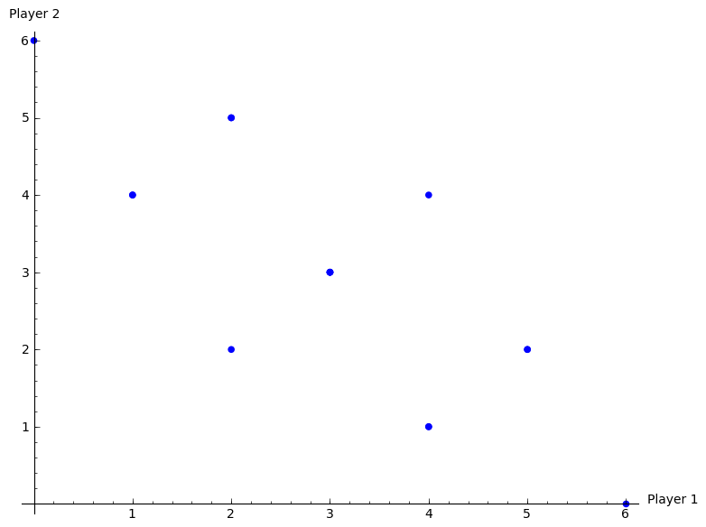

# OR 3: Chapter 9 - Finitely Repeated Games

## Recap

In the [previous chapter](Chapter_08-Subgame_Perfection.html):

- We looked at the connection between games in normal form and extensive form;
- We defined a subgame;
- We define a refinement of Nash equilibrium: subgame perfect equilibrium.

In this chapter we'll start looking at instances where games are repeated.

## Definition of a repeated game

- Definitions

- Description of strategy

## Subgame perfect Nash equilibrium in repeated games

### Theorem

---

For any repeated game, any sequence of stage Nash profiles gives the outcome of a subgame perfect Nash equilibrium.

---

If we consider the strategy given by:

> "Player $i$ should play strategy $\tilde s^{(k)}_i$ regardless of the play of any previous strategy profiles."

where $\tilde s^{(k)}_i$ is the strategy played by player $i$ in any stage Nash profile. The $k$ is used to indicate that all players play strategies from the same stage Nash profile.

Using backwards induction we see that this strategy is a Nash equilibrium. Furthermore it is a stage Nash profile so it is a Nash equilibria for the last stage game which is the last subgame. If we consider (in an inductive way) each subsequent subgame the result holds.

### Example

Consider the following stage game:

$$\begin{pmatrix}
(1,3)&(2,10)\\
(2,2)&(4,1)\\
\end{pmatrix}$$

The following plot shows the various possible outcomes of the repeated game for $T=2$:

If we consider the two pure equilibria $(r_1,s_2)$ and $(r_2,s_1)$, we have 4 possible outcomes that correspond to the outcome of a subgame perfect Nash equilibria:

$$(r_1r_1,s_2s_2)\text{ giving utility vector: }(4,20)$$
$$(r_1r_2,s_2s_1)\text{ giving utility vector: }(4,12)$$
$$(r_2r_1,s_1s_2)\text{ giving utility vector: }(4,12)$$
$$(r_2r_2,s_1s_1)\text{ giving utility vector: }(4,4)$$

Importantly, not all subgame Nash equilibria outcomes are of the above form.

## Reputation in repeated games

- Give example (Try above game but be ready to use a different one)  of a reputation based strategy that is not a stage equilibria but is subgame perfect.

