# OR 3: Chapter 15 - Cooperative game theory

## Recap

In the [previous chapter](Chapter_14_Stochastic_games.md):

- We defined stochastic games;
- We investigated approached to obtaining Markov strategy Nash equilibria.

In this chapter we will take a look at a very different type of game.

## Matching Games

Consider the following situation:

> "In a population of $N$ suitors and $N$ reviewers. We allow the suitors and reviewers to rank their preferences and are now trying to match the suitors and reviewers in such a way as that every matching is stable."

If we consider the following example with suitors: $S=\{a,b,c\}$ and reviewers: $R=\{A,B,C\}$ with preferences shown\text{ in Figure \ref{L15-img01}}.

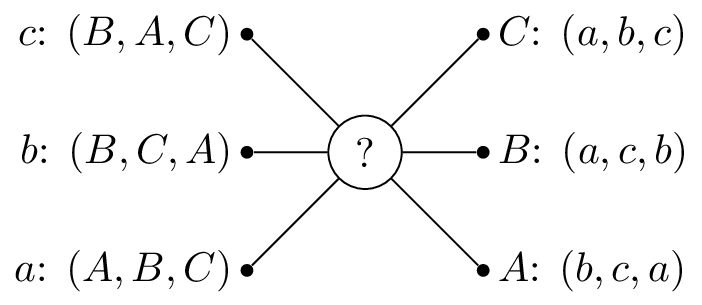

So that $c$ would prefer to be matched with $b$, then $c$ and lastly $c$. One possible matching would be is shown\text{ in Figure \ref{L15-img02}}.

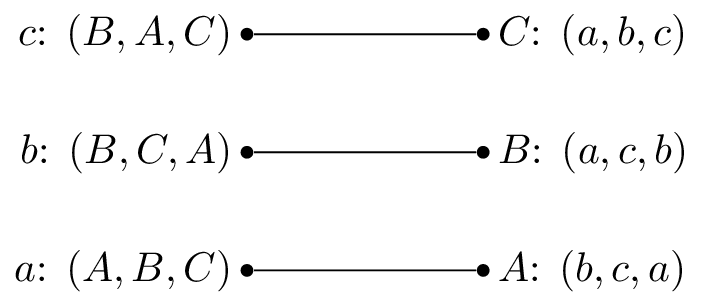

In this situation, $a$ and $b$ are getting their first choice and $c$ their second choice. However $B$ actually prefers $c$ so that matching is unstable.

Let us write down some formal definitions:

### Definition of a matching game

---

A matching game of size $N$ is defined by two disjoint sets $S$ and $R$ or suitors and reviewers of size $N$. Associated to each element of $S$ and $R$ is a preference list:

$$f:S\to R^N\text{ and }g:R\to S^N$$

A matching $M$ is a any bijection between $S$ and $R$. If $s\in S$ and $r\in R$ are matched by $M$ we denote:

$$M(s)=r$$

---

### Definition of a blocking

---

A pair $(s,r)$ is said to **block** a matching $M$ if $M(s)\ne r$ but $s$ prefers $r$ to $M(r)$ and $r$ prefers $s$ to $M^{-1}(r)$.

---

In our previous example $(c,B)$ blocks the proposed matching.

### Definition of a stable matching

---

A matching $M$ with no blocking pair is said to be stable.

---

A stable matching is shown\text{ in Figure \ref{L15-img03}}.

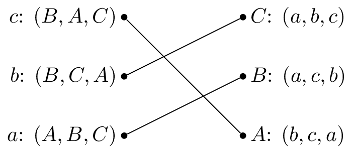

The stable matching is not unique, the matching shown\text{ in Figure \ref{L15-img04}} is also stable:

## The Gale-Shapley Algorithm

Here is the Gale-Shapley algorithm, which gives a stable matching for a matching game:

1. Assign every $s\in S$ and $r\in R$ to be unmatched
2. Pick some unmatched $s\in S$, let $r$ be the top of $s$'s preference list:
    - If $r$ is unmatched set $M(s)=r$
    - If $r$ is matched:
        - If $r$ prefers $s$ to $M^{-1}(r)$ then set $M(r)=s$
        - Otherwise $s$ remains unmatched and remove $r$ from $r$'s preference list.
3. Repeat step 2 until all $s\in S$ are matched.

Let us illustrate this algorithm with the above example\text{ (shown again in Figure \ref{L15-img05})}.

We pick $c$ and as all the reviewers are unmatched set $M(c)=B$\text{ as shown in Figure \ref{L15-img06}}.

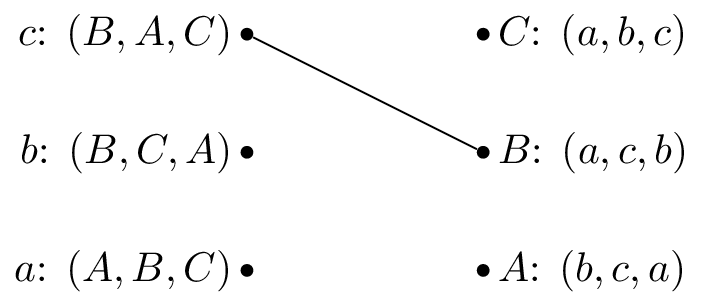

We pick $b$ and as $B$ is matched but prefers $c$ to $b$ we cross out $B$ from $b$'s preferences\text{ as shown in Figure \ref{L15-img07}}.

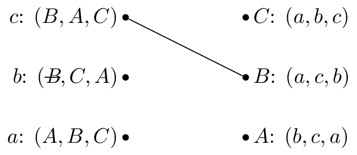

We pick $b$ again and set $M(b)=C$\text{ as shown in Figure \ref{L15-img08}}.

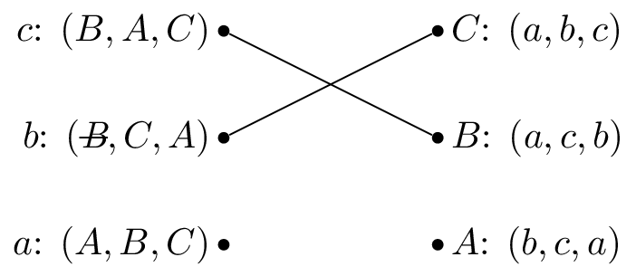

We pick $a$ and set $M(a)=A$\text{ as shown in Figure \ref{L15-img04}}.

**Let us repeat the algorithm but pick $b$ as our first suitor. \text{ We initialise the game as shown in Figure \ref{L15-img05}.}**

We pick $b$ and as all the reviewers are unmatched set $M(b)=B$\text{ as shown in Figure \ref{L15-img09}}.

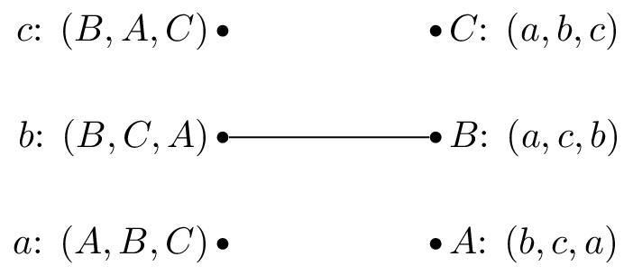

We pick $a$ and as $A$ is unmatched set $M(a)=A$\text{ as shown in Figure \ref{L15-img10}}.

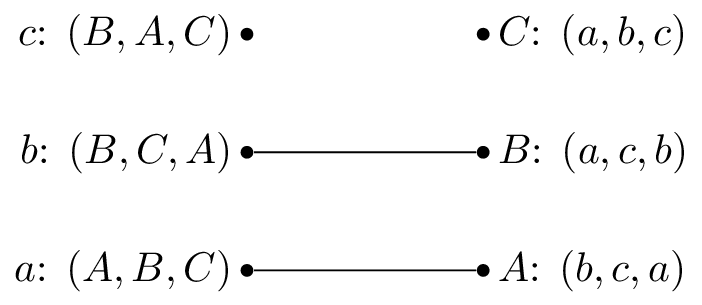

We pick $c$ and $b$ is matched but prefers $c$ to $M^{-1}(B)=b$, we set $M(c)=B$\text{ as shown in Figure \ref{L15-img11}}.

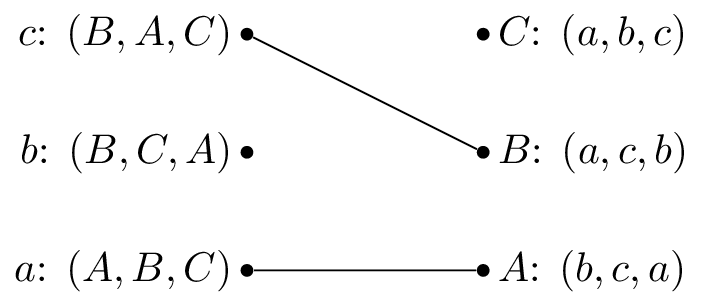

We pick $b$ and as $B$ is matched but prefers $c$ to $b$ we cross out $B$ from $b$'s preferences:

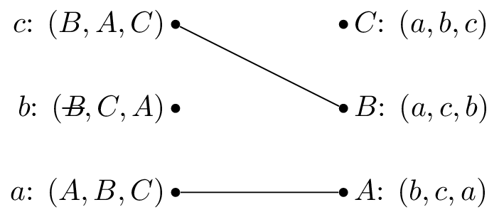

We pick $b$ again and set $M(b)=C$\text{ as shown in Figure \ref{L15-img13}}.

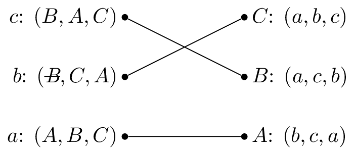

Both these have given the same matching.

### Theorem guaranteeing a unique matching as output of the Gale Shapley algorithm.

---

All possible executions of the Gale-Shapley algorithm yield the same stable matching **and** in this stable matching every suitor has the best possible partner in any stable matching.

---

###Proof

---

Suppose that an arbitrary execution $\alpha$ of the algorithm gives $M$ and that another execution $\beta$ gives $M'$ such that $\exists$ $s\in S$ such that $s$ prefers $r'=M'(s)$ to $r=M(s)$.

Without loss of generality this implies that during $\alpha$ $r'$ must have rejected $s$. Suppose, again without loss of generality that this was the first occasion that a rejection occured during $\alpha$ and assume that this rejection occurred because $r'=M'(s')$. This implies that $s'$ has no stable match that is higher in $s'$'s preference list than $r'$ (as we have assumed that this is the first rejection).

Thus $s'$ prefers $r'$ to $M'(s')$ so that $(s',r')$ blocks $M'$. Each suitor is therefore matched in $M$ with his favorite stable reviewer and since $\alpha$ was arbitrary it follows that all possible executions give the same matching.

---

We call a matching obtained from the Gale Shapley algorithm _suitor-optimal_ because of the previous theorem. The next theorem shows another important property of the algorithm.

### Theorem of reviewer sub optimality

---

In a suitor-optimal stable matching each reviewer has the worst possible matching.

---

### Proof

---

Assume that the result is not true. Let $M_0$ be a suitor-optimal matching and assume that there is a stable matching $M'$ such that $\exists$ $r$ such that $r$ prefers $s=M_0^{-1}(r)$ to $s'=M'^{-1}(r)$. This implies that $(r,s)$ blocks $M'$ unless $s$ prefers $M'(s)$ to $s$ which contradicts the fact the $s$ has no stable match that he prefers in $M_0$.

---
