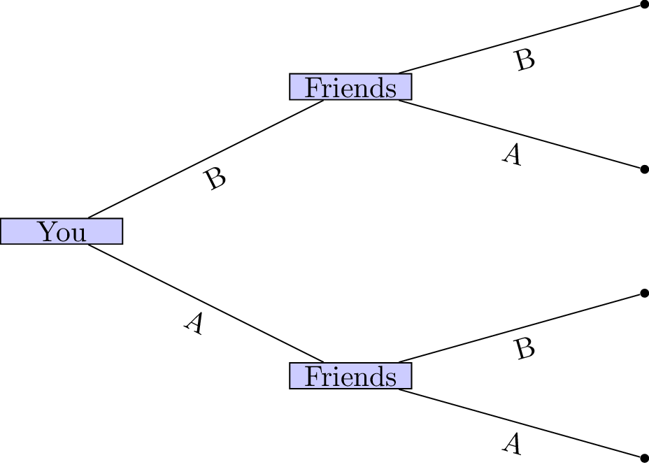

# OR 3: Lecture 1
## Introduction

### What is game theory?

- Paragraph about general ideas.
- 2/3rds of average game.

Game theory can be described briefly as the study of interactive decision making. 

#### Coffee house example
Let us consider the very simple situation where **you** decide where to meet your **friends**. You have some information about their behaviour:

- 20% of the time they go to coffee house A;
- 80% of the time they go to coffee house B.

If you wanted to maximise your chance of meeting your friends: what should you do?

The above tree shows that if **you** were to choose your location first it would be in your interest of choosing coffee house B. This gives you an 80% chance of being in the same location as your **friends**.

In general these sorts of decisions are not at the mercy of chance. **You** would probably choose to go to coffee house A or B and simply let your friends know where you are so that they could make an informed decision. This consecutive making of decisions is a type of game.

In this game the outcome (whetheer or not your friends and you have a coffee together) depends on the actions of all the players. 

#### 2/3rds of the average game

Let us consider another type of game.

### Extensive Form Games

#### Description
#### Lack of Information
