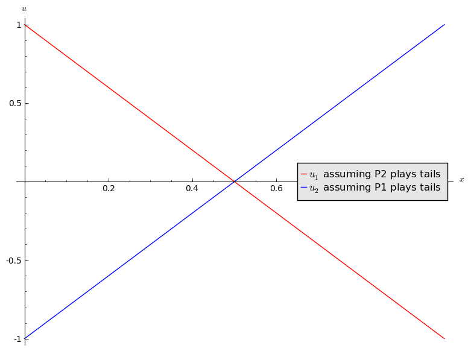

# OR 3: Lecture 2 - Normal Form Games

## Recap

In the [previous lecture](Lecture_1-Introduction.html) we discussed:

- Interactive decision making;
- Normal form games;
- Normal form games and representing information sets.

We did this looking at a game called "the battle of the sexes":

Can we think of a better way of representing this game?

## Normal form games

One other representation for a game is called the **normal form**.

### Definition

---

A $n$ player **normal form game** consists of:

1. A finite set of $n$ players;
2. Strategy spaces for the players: $S_1, S_2, S_3, \dots S_n$;
3. Payoff functions for the players: $u_i:S_{1}\times S_2\dots\times S_n\to \mathbb{R}$

---

The convention used in this course (unless otherwise stated) is that all players aim to choose from their strategies in such a way as to maximise their utilities.

A natural way of representing a two player normal form game is using a **bi-matrix**. If we assume that $S_1=\{r_i\;|\;1\leq i\leq m \}$ and $S_2=\{s_j\;|\;1\leq j\leq n \}$ then the following is a **bi-matrix** representation of the game considered:

### Some examples

#### The battle of the sexes

>This is the game we've been looking at between Bob and Celine:

$$
\begin{pmatrix}
(3,2)&(0,0)\\
(1,1)&(2,3)
\end{pmatrix}
$$

#### Prisoners' Dilemma

> Assume two thieves have been caught by the police and separated for questioning. If both thieves cooperate and don't divulge any information they will each get a short sentence. If one defects he/she is offered a deal while the other thief will get a long sentence. If they both defect they both get a medium sentence.

$$
\begin{pmatrix}
(2,2)&(0,3)\\
(3,0)&(1,1)
\end{pmatrix}
$$

#### Hawk-Dove/Chicken

> Suppose...

$$
\begin{pmatrix}
(0,0)&(3,1)\\
(1,3)&(2,2)
\end{pmatrix}
$$

#### Coordination

> Suppose...

$$
\begin{pmatrix}
(1,1)&(0,0)\\
(0,0)&(1,1)
\end{pmatrix}
$$

#### Pareto Coordination

> Suppose...

$$
\begin{pmatrix}
(2,2)&(0,0)\\
(0,0)&(1,1)
\end{pmatrix}
$$

#### Pigs

> Suppose...

$$
\begin{pmatrix}
(4,2)&(2,3)\\
(6,-1)&(0,0)
\end{pmatrix}
$$

## Mixed Strategies

So far we have only considered so called **pure strategies**. We will now allow players to play **mixed strategies**.

### Definition

---

In an $n$ player normal form game a **mixed strategy** for player $i$ denoted by $\sigma_i\in[0,1]^{|S_i|}_{\mathbb{R}}$ is a probability distribution over the pure strategies of player $i$.

---

For example in the matching pennies game discussed previously. A strategy profile of $\sigma_1=(.2,.8)$ and $\sigma_2=(.6,.4)$ implies that player 1 plays heads with probability .2 and player 2 plays heads with probability .6.

We can extend the utility function which maps from the set of pure strategies to $\mathbb{R}$ using _expected payoffs_. For a two player game we have:

$$u_{i}(\sigma_1,\sigma_2)=\sum_{r\in S_1,s\in S_2}\sigma_1(r)\sigma_2(s)u_{i}(r,s)$$

(where we relax our notation to allow $\sigma_i:S_i\to[0,1]_{\mathbb{R}}$)

## Matching pennies revisited.

In the previously discussed strategy profile of $\sigma_1=(.2,.8)$ and $\sigma_2=(.6,.4)$ the expected utilities can be calculated as follows:

$$u_{1}(\sigma_1,\sigma_2)=\sum_{r\in S_1,s\in S_2}\sigma_1(r)\sigma_2(s)u_{1}(r,s)=.2\times.6\times 1+.2\times.4\times (-1)+.8\times .6\times (-1) + .8\times .4\times 1=-.12$$
$$u_{2}(\sigma_1,\sigma_2)=\sum_{r\in S_1,s\in S_2}\sigma_1(r)\sigma_2(s)u_{2}(r,s)=.2\times.6\times (-1)+.2\times.4\times 1+.8\times .6\times 1 + .8\times .4\times (-1)=.12$$

### Example

---

If we assume that player 2 always plays tails, what is the expected utility to player 1?

Let $\sigma_1=(x,1-x)$ and we have $\sigma_2=(0,1)$ which gives:

$$u_{1}(\sigma_1,\sigma_2)=\sum_{r\in S_1,s\in S_2}\sigma_1(r)\sigma_2(s)u_{1}(r,s)=-x+(1-x)=1-2x$$

Similarly if player 1 always plays tails the expected utility to player 2 is:

$$u_{2}(\sigma_1,\sigma_2)=\sum_{r\in S_1,s\in S_2}\sigma_1(r)\sigma_2(s)u_{2}(r,s)=x+(x-1)=2x-1$$

A plot of this is shown here:

Add to this plot by assuming that the players independently both play heads.
