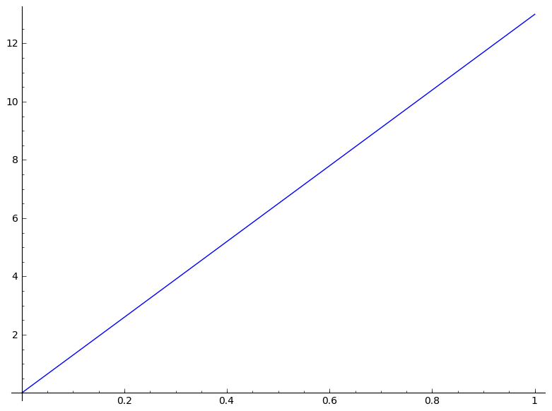
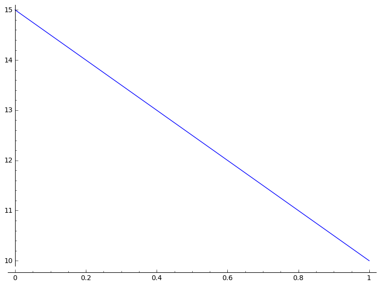
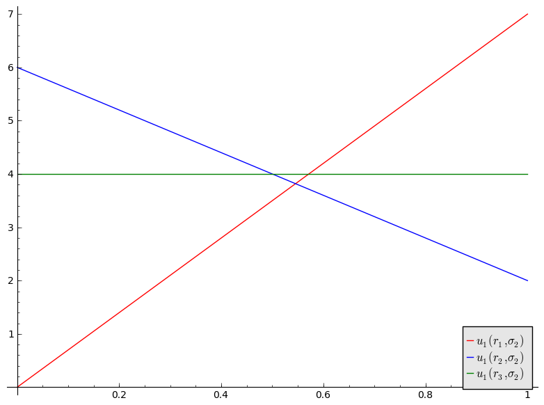
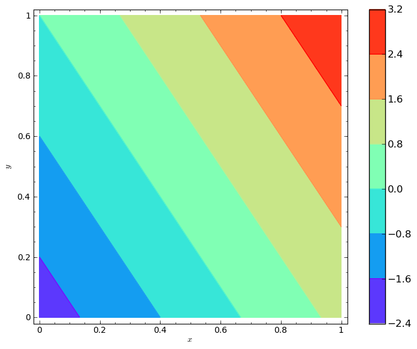

# Homework sheet 1 - Normal form games

1. Represent the following game in normal form:

    > Alice, Bob and Celine are childhood friends that would like to communicate online. They have a choice between 4 social networks: facebook, twitter and G+.

    Clearly state the players, strategy sets and interpretations of the utilities.

    **Solution**

    The set of players is $\{A, B, C\}$. The strategy space is $S_A=S_B=S_C=\{\text{fb}, t, G\}$.

    The payoff functions are given below:

    $$u_i(s_1,s_2,s_3)=|\{r \in s\setminus s_i\;|\;r=s_i\}|$$

    (ie the utility of player $i$ is equal to the number of players that have picked the same strategy as player $i$.)

    Here is the normal form representation:

    - $s_A=\text{fb}$:

    $$\begin{pmatrix}
       (2,2,2)&(1,1,0)&(1,1,0)\\
       (1,0,1)&(0,1,1)&(0,0,0)\\
       (1,0,1)&(0,0,0)&(0,1,1)\\
    \end{pmatrix}$$

    - $s_A=t$:

    $$\begin{pmatrix}
       (0,1,1)&(1,0,1)&(0,0,0)\\
       (1,1,0)&(2,2,2)&(1,1,0)\\
       (0,0,0)&(1,0,1)&(0,1,1)\\
    \end{pmatrix}$$

    - $s_A=G$:

    $$\begin{pmatrix}
       (0,1,1)&(0,0,0)&(1,0,1)\\
       (0,0,0)&(0,1,1)&(1,0,1)\\
       (1,1,0)&(1,1,0)&(2,2,2)\\
    \end{pmatrix}$$

2. Represent the following game in normal form:

    > Assume two neighbouring countries have at their disposal very destructive armies. If both countries attack each other the countries' civilian population will suffer 10 thousand casualties. If one country attacks whilst the other remains peaceful, the peaceful country will lose 15 thousand casualties but would also retaliate causing the offensive country 13 thousand casualties. If both countries remain peaceful then there are no casualties.

    - Clearly state the players and strategy sets.
    - Plot the utilities to both countries assuming that they play a mixed strategy while the other country remains peaceful.
    - Plot the utilities to both countries assuming that they play a mixed strategy while the other country attacks.

    **Solution**

    Players: $\{P_1, P_2\}$. The strategy space is $\{A,P\}$. We take the utility to be the number of casualties suffered (players aim to minimize their utility):

    $$\begin{pmatrix}
    (10,10)&(13,15)\\
    (15,13)&(0,0)
    \end{pmatrix}$$

    $$u_1((x,1-x),(0,1))=13x$$

    \

    (Same plot for $P_2$)

    $$u_1((x,1-x),(1,0))=10x+15(1-x)=15-5x$$

    \

    (Same plot for $P_2$)

3. Dominance

    Attempt to predict rational behaviour **using iterated elimination of dominated strategies** for the following:

    - $$\begin{pmatrix}
    (2,1)&(1,1)\\
    (1,1)&(1,3)\\
    \end{pmatrix}$$

        **Solution**

        We see that $r_1$ weakly dominates $r_2$ so we have:

        $$\begin{pmatrix}
        (2,1)&(1,1)\\
        \end{pmatrix}$$

        Thus a predicted strategy profile is $(r_1,s_1)$.

        Importantly, we see however that $s_2$ weakly dominates $s_1$ which would give:

        $$\begin{pmatrix}
        (1,1)\\
        (1,3)\\
        \end{pmatrix}$$

        Thus another predicted strategy profile is $(r_2, s_2)$.

    - $$\begin{pmatrix}
    (2,11)&(1,9)&(3,10)&(17,22)\\
    (27,0)&(3,1)&(1,1)&(1,0)\\
    (4,2)&(6,10)&(7,12)&(18,0)\\
    \end{pmatrix}$$

        **Solution**

        We see that $s_2$ is weakly dominated by $s_3$ so we have:

        $$\begin{pmatrix}
        (2,11)&(3,10)&(17,22)\\
        (27,0)&(1,1)&(1,0)\\
        (4,2)&(7,12)&(18,0)\\
        \end{pmatrix}$$

        Now $r_3$ strictly dominates $r_1$ so we have:

        $$\begin{pmatrix}
        (27,0)&(1,1)&(1,0)\\
        (4,2)&(7,12)&(18,0)\\
        \end{pmatrix}$$

        Now $s_3$ stricly dominates $s_1$ and $s_4$ so we have:

        $$\begin{pmatrix}
        (1,1)\\
        (7,12)\\
        \end{pmatrix}$$

        Thus the predicted rational behaviour is $(r_3, s_3)$.

    - $$\begin{pmatrix}
    (3,2)&(3,1)&(2,3)\\
    (2,2)&(1,3)&(3,2)\\
    \end{pmatrix}$$

        **Solution**

        There are no dominated strategies in this game.

    - $$\begin{pmatrix}
    (3,-3)&(-1,1)\\
    (2,1)&(7,-6)\\
    \end{pmatrix}$$

        **Solution**

        There are no dominated strategies in this game.

    Explain when games occur that cannot be handled this way.

4. For all of the games of question 3, identify all best responses and attempt to predict rational behaviour.

    **Solution**

    - $$\begin{pmatrix}
    (\underline{2},\underline{1})&(\underline{1},\underline{1})\\
    (1,1)&(\underline{1},\underline{3})\\
    \end{pmatrix}$$

        We have 3 pairs of best responses: $(r_1,s_1),(r_1,s_2),(r_2,s_2)$.

    - $$\begin{pmatrix}
    (2,11)&(1,9)&(3,10)&(17,\underline{22})\\
    (\underline{27},0)&(3,\underline{1})&(1,\underline{1})&(1,0)\\
    (4,2)&(\underline{6},10)&(\underline{7},\underline{12})&(\underline{18},0)\\
    \end{pmatrix}$$

        We have a single pair of best responses: $(r_3,s_3)$.

    - $$\begin{pmatrix}
    (\underline{3},2)&(\underline{3},1)&(2,\underline{3})\\
    (2,2)&(1,\underline{3})&(\underline{3},2)\\
    \end{pmatrix}$$

        There are no pairs of best responses.

    - $$\begin{pmatrix}
    (\underline{3},-3)&(-1,\underline{1})\\
    (2,\underline{1})&(\underline{7},-6)\\
    \end{pmatrix}$$

        There are no pairs of best responses.

Explain when games occur that cannot be handled this way.

5. Consider the following game:

    $$\begin{pmatrix}
    (7,3)&(0,2)\\
    (2,1)&(6,1)\\
    (4,0)&(4,2)\\
    \end{pmatrix}$$

    Compute directly $B_1,B_2,UD_1$ and $UD_2$.

    **Solution**

    By definition:

    $$UD_1=\\{s\in\{r_1,r_2,r_3\}\\;|\;\text{$s$ is not strictly dominated}\}$$

    Thus $UD_1=\{r_1, r_2, r_3\}$

    Similarly:

    $$UD_2=\{s\in\{s_1,s_2\}\;|\;\text{$s$ is not strictly dominated}\}$$

    Thus $UD_2=\{s_1, s_2\}$

    By definition

    $$B_1=\{s\in\{r_1,r_2,r_3\}|\;\exists \sigma\in\Delta S_{2} \text{such that $s$ is a best response to $\sigma$}\}$$

    Let us assume that player 2 plays $\sigma_2=(x,1-x)$. This gives:

    $$u_1(r_1,\sigma_2)=7x$$
    $$u_1(r_2,\sigma_2)=2x+6(1-x)=6-4x$$
    $$u_1(r_3,\sigma_2)=4x+4(1-x)=4$$

    If we plot these utilities:

    \

    we see that all strategies are a best response to a strategy in $\Delta S_2$: $B_1=\{r_1, r_2, r_3\}$.

    By definition

    $$B_2=\{s\in\{s_1,s_2\}|\;\exists \sigma\in\Delta S_{1} \text{such that $s$ is a best response to $\sigma$}\}$$

    Let us assume that player 1 plays $\sigma_1=(x,y,1-x-y)$. This gives:

    $$u_2(\sigma_1, s_1)=3x+y$$
    $$u_2(\sigma_1, s_2)=2x+y+2-2x-2y=2-y$$

    We see that $u_2(\sigma_1, s_1)>u_2(\sigma_1, s_2)$ $\Rightarrow$ $3x+y>2-y$ $\Rightarrow$ $x>\frac{2-2y}{3}$. Thus (finding an obvious example) $\sigma_1=(2/3,0,1/3)\in\Delta S_1$ has $s_1$ as a best response and similarly $\sigma_1=(1/3,0,2/3)\in\Delta S_2$ has $s_2$ as a best response. This gives $B_2=\{s_1, s_2\}$.

    To illustrate this further here is a contour plot of $u_2(\sigma_1,s_1)-u_2(\sigma_1,s_2)$:

    \

6. In the notes the following theorem is given:

    ---

    In a 2 player normal form game $B_i = UD_i$ for all $i \in\{1,2\}$.

    ---

    Prove the theorem for 2 player games with $|S_1|=|S_2|=2$. I.e. prove the above result in the special case of $2\times 2$ games.

    **Solution**

    Let us consider the $2\times 2$ game:

    $$\begin{pmatrix}
    (a_{11},b_{11})& (a_{12},b_{12})\\
    (a_{21},b_{21})& (a_{22},b_{22})\\
    \end{pmatrix}$$

    We prove the result for $i=1$ without loss of generality. Let us consider the two following cases:

    $$UD_1=\\{r_1\\}\text{ and }UD_1=\\{r_1,r_2\\}$$

    - If $UD_1=\\{r_1\\}$ $\Rightarrow$ $a_{1j}> a_{2j}$ for $j\in\\{1,2\\}$. This gives:

        $$u_1(r_1,\sigma_2)=a_{11}x+a_{12}(1-x)> a_{12}x+a_{22}(1-x)=u_1(r_2,\sigma_2)$$

        So $r_2$ is never a best response giving $B_1=\\{r_1\\}$ as required.

    - If $UD_1=\\{r_1, r_2\\}$ this implies that one of the following must hold:

        $$
        a_{11} > a_{21} \text{ and } a_{12}\leq a_{22}\text{ (1)}
        $$
        $$
        a_{11} \geq a_{21} \text{ and } a_{12}< a_{22}\text{ (2)}
        $$
        $$
        a_{11} < a_{21} \text{ and } a_{12}\geq a_{22}\text{ (3)}
        $$
        $$
        a_{11} \leq a_{21} \text{ and } a_{12}> a_{22}\text{ (4)}
        $$

    Consider wlog case (1). As before we have:

    $$u_1(r_1,\sigma_2)=a_{11}x+a_{12}(1-x)$$
    $$u_1(r_2,\sigma_2)=a_{21}x+a_{22}(1-x)$$

    Thus the point at which $u_1(r_1,\sigma_2)-u_1(r_2,\sigma_2)=0$ is:

    $$\frac{a_{22}-a_{12}}{a_{11}-a_{12}+a_{22}-a_{21}}$$

    Assuming that equality in (1) does not hold then this point is strictly between 0 and 1 thus a value of $0<x<1$ can be found for which either $r_1$ or $r_2$ is a best response. This gives: $$B_1=\\{r_1,r_2\\}$$

    If equality holds in (1) then both strategies are best responses giving the same conclusion.
