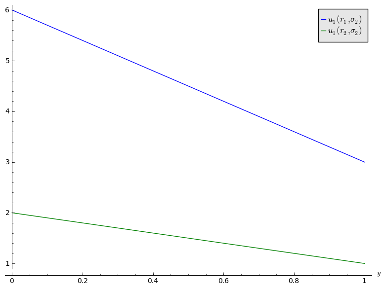
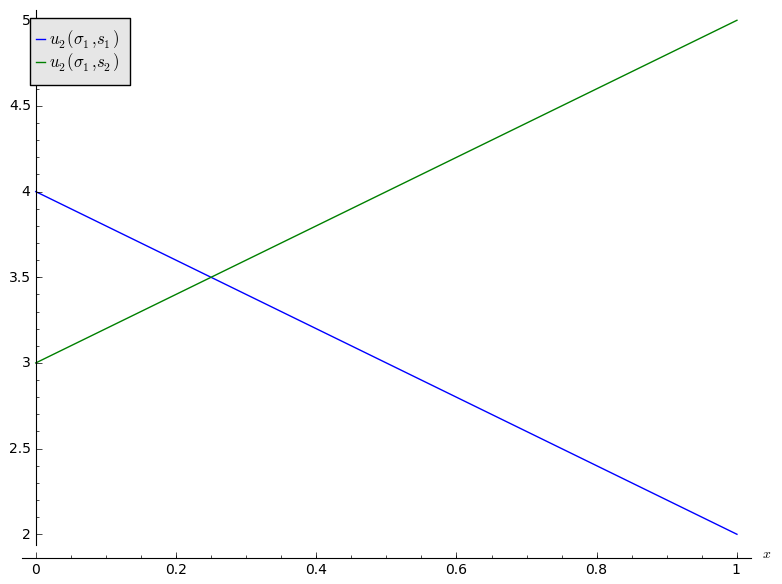
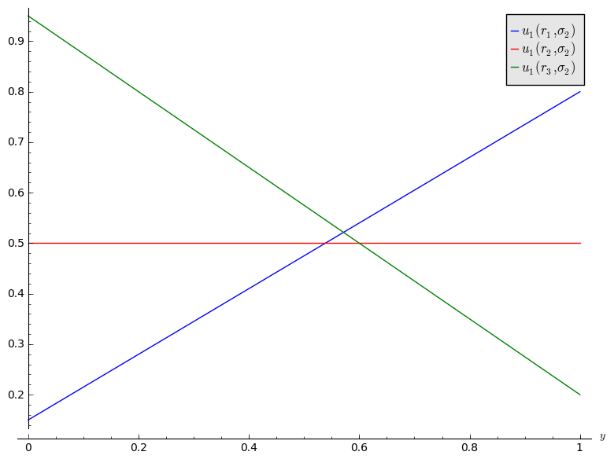

# Homework sheet 2 - Nash equilibrium in normal form games

1. Compute the Nash equilibrium (if they exist) in pure strategies for the following games:

    **Solution**

    $$\begin{pmatrix}
    (5,\underline{3})&(70,-1)&(\underline{4},2)\\
    (\underline{6},\underline{7})&(\underline{71},2)&(2,1)
    \end{pmatrix}$$

    $$\begin{pmatrix}
    (\underline{6},\underline{7})&(2,1)&(\underline{4},6)\\
    (0,4)&(\underline{3},\underline{8})&(2,3)\\
    (1,2)&(1,\underline{5})&(1,1)\\
    \end{pmatrix}$$

    $$\begin{pmatrix}
    (\underline{\pi},\underline{e})&(1-\pi,\sqrt(e))\\
    (\sqrt(2),1/e)&(\underline{2},\underline{1})
    \end{pmatrix}$$

2. For what values of $\alpha$ does a Nash equilibrium exist in pure strategies for the following game:

    $$\begin{pmatrix}
    (3,5)&(2-\alpha,\alpha)\\
    (4\alpha,6)&(\alpha,\alpha^2)
    \end{pmatrix}$$

    **Solution**

    - $(r_1,s_1)$ is a pure strategy Nash equilibrium if:

        $3\geq 4\alpha$ and $5\geq\alpha$

        Thus $(r_1,s_1)$ is a Nash equilibrium iff $\alpha\leq3/4$.

    - $(r_1,s_2)$ is a pure strategy Nash equilibrium if:

        $2-\alpha \geq \alpha$ and $\alpha\geq 5$

        This is not possible.

    - $(r_2,s_1)$ is a pure strategy Nash equilibrium if:

        $4\alpha \geq 3$ and $6\geq \alpha^2$

        Thus $(r_2,s_1)$ is a Nash equilibrium iff $3/4\leq \alpha \leq \sqrt{6}$

    - $(r_2,s_2)$ is a pure strategy Nash equilibrium if:

        $\alpha\geq 2-\alpha$ and $6\leq \alpha^2$

        Thus $(r_2,s_2)$ is a Nash equilibrium iff $\alpha\geq\sqrt{6}$

3. Consider the following game:

    Suppose two vendors (of an identical product) must choose their location along a busy street. It is anticipated that their profit is directly related to their position on the street.

    If we allow their positions to be represented by a points $x_1, x_2$ on the $[0,1]_{\mathbb{R}}$ line segment then we have:

    $$u_1(x_1,x_2)=\begin{cases}x_1+(x_2-x_1)/2,&\text{if }x_1\leq x_2\\
    1-x_1+(x_2-x_1)/2,&\text{otherwise}
    \end{cases}$$
    and
    $$u_1(x_1,x_2)=\begin{cases}x_2+(x_2-x_1)/2,&\text{if }x_2\leq x_1\\
    1-x_2+(x_2-x_1)/2,&\text{otherwise}
    \end{cases}$$

    By considering best responses of each player, identify the Nash equilibrium for the game.

    **Solution**

    Consider $x_j<1/2$, if $x_i=x_j$ then $u_i(x_i,x_j)=1/2$. However $u_i(x_j+\epsilon,x_j)=1-x_2-\epsilon/2>1/2-\epsilon/2$ for some (arbitrarily) small $\epsilon>0$ . Thus for arbitrarily small $\epsilon$, $x_i^*=x_j+\epsilon$.
    If $x_j>1/2$ a similar argument gives $x_i^*=x_j-\epsilon$.
    If $x_j=1/2$, considering $x_i=x_j$ we see that neither player has an incentive to move.

    Thus we conclude:

    $$x_i^*=\begin{cases}
    x_j+\epsilon,&\text{ if }x_j<1/2\\
    x_j-\epsilon&\text{ if }x_j>1/2\\
    x_j&\text{ if }x_j=1/2\\
    \end{cases}$$

    So the Nash equilibrium for this problem is $(\tilde x_1, \tilde x_2)=(1/2,1/2)$.

4. Consider the following game:

    $$\begin{pmatrix}
    (3,2)&(6,5)\\
    (1,4)&(2,3)
    \end{pmatrix}$$

    Plot the expected utilities for each player against mixed strategies and use this to obtain the Nash Equilibria.

    **Solution**

    We have:

    $$u_1(r_1,(y,1-y))=3y+6-6y=6-3y$$
    $$u_2(r_2,(y,1-y))=y+2-2y=2-y$$

    Here is a plot of this:

    

    We see that $r_2$ is dominated by $r_1$. For player 2, we have:

    $$u_1((x,1-x),s_1)=2x+4-4x=4-2x$$
    $$u_2((x,1-x),s_2)=5x+3-3x=3+2x$$

    Here is a plot of this:

    

    As $r_2$ is dominated, we see from the plot that the Nash equilibrium is $(r_1, s_2)$.

5. Assume a soccer player (player 1) is taking a penalty kick and has the option of shooting left or right: $S_1=\{\text{SL},\text{SR}\}$. A goalie (player 2) can either dive left or right: $S_2=\{\text{DL}, \text{DR}\}$. The chances of a goal being scored are given below:

    $$\begin{pmatrix}
    .8&.15\\
    .2&.95
    \end{pmatrix}$$

    i. Assume the utility to player 1 if the probability of scoring and the utility to player 2 the probability of a goal not being scored. What is the Nash equilibrium for this game?

    **Solution**

    We see that this is a zero sum game with bi-matrix:

    $$\begin{pmatrix}
    (.8,.2)&(.15,.85)\\
    (.2,.8)&(.95,.05)
    \end{pmatrix}$$

    There are no pure Nash equilibria. To obtain the NE, we use the Equality of Payoffs theorem:

    $$.2x+.8(1-x)=(.85x+.05(1-x))\Rightarrow x=15/28$$
    $$.8y+.15(1-y)=.2y+.95(1-y)\Rightarrow y=4/7$$

    So the Nash Equilibrium is $\{(15/28,13/28),(4/7,3/7)\}$.

    ii. Assume that player 1 now has a further strategy available: to shoot in the middle: $S_1=\{\text{SL},\text{SM}, \text{SR}\}$ the probabilities of a goal being scored are now given:

    $$\begin{pmatrix}
    .8&.15\\
    .5&.5\\
    .2&.95
    \end{pmatrix}$$

    Obtain the new Nash equilibrium for the game.

    **Solution**

    There are various approaches to this game, one is to apply the equality of payoffs theorem to all possible supports. Another is to plot the utilities:

    

    We see that $B_1=\{r_1,r_3\}$, by the equality theorem this gives $UD_1=\{r_1,r_3\}$ and so the Nash equilibria is the same as before.

6. In the notes the following theorem is given:

    ---

    Every normal form game with a finite number of pure strategies for each player, has at least one Nash equilibrium.

    ---

    Prove the theorem for 2 player games with $|S_1|=|S_2|=2$. I.e. prove the above result in the special case of $2\times 2$ games.

    **Solution**

    Let us consider the $2\times 2$ game:

    $$\begin{pmatrix}
    (a_{11},b_{11})& (a_{12},b_{12})\\
    (a_{21},b_{21})& (a_{22},b_{22})\\
    \end{pmatrix}$$

    There is no pure strategy Nash equilibrium if either:

    1. $a_{11}<a_{21}$ and $b_{21}<b_{22}$ and $a_{22}<a_{12}$ and $b_{12}<b_{11}$ or
    2. $a_{11}>a_{21}$ and $b_{21}>b_{22}$ and $a_{22}>a_{12}$ and $b_{12}>b_{11}$ or

    In each of these cases we use the Equality of payoffs theorem:

    $$
    u_1(r_1,\sigma_2) = u_1(r_2,\sigma_2)
    $$

    $$
    a_{11}y+a_{12}(1-y) = a_{21}y+a_{22}(1-y)
    $$

    which gives:

    $$y = \frac{a_{12} - a_{22}}{a_{12}-a_{22} + a_{21} - a_{11}}$$

    Similarly:

    $$x = \frac{b_{22} - b_{21}}{b_{22}-b_{21} + b_{11} - b_{12}}$$

    In both cases the $0<x,y<1$ as required.
