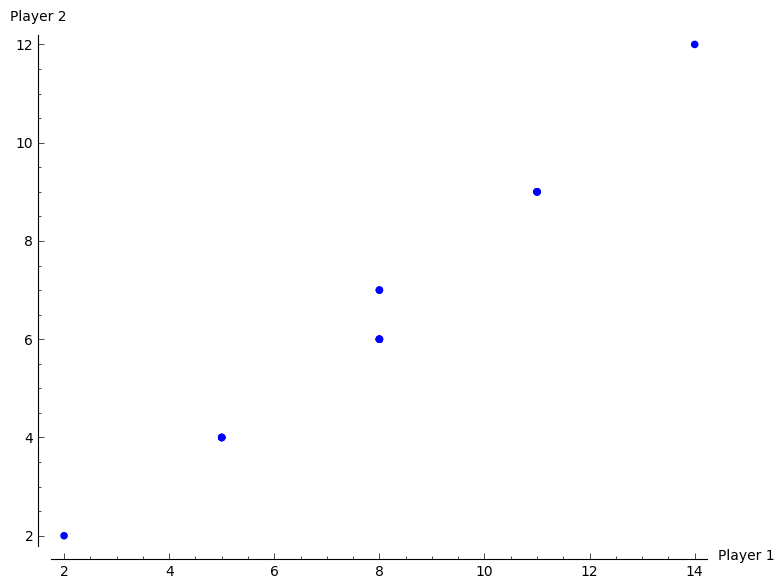
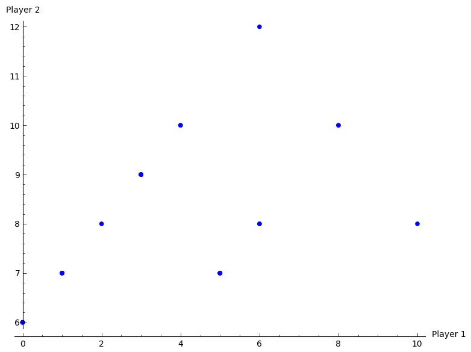
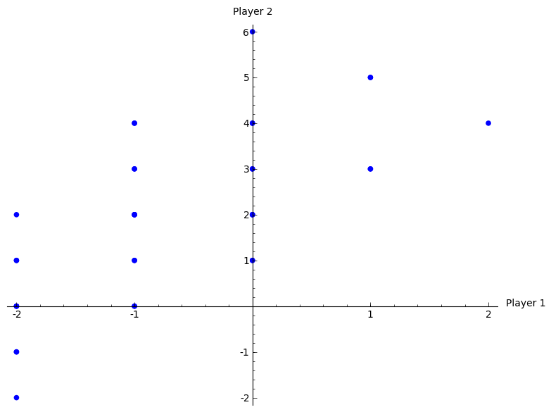

# Homework sheet 3 - Extensive form games, subgame perfect equilibrium and repeated games

1. Obtain the Nash equilibrium for the following games using backward induction:

\

**Solution**

$$(AZY,CX)$$

\

**Solution**

$$(WNYLL,AC)$$

\

For $P_3$, $B$ dominates $A$, for $P_2$, $B$ dominates $A$, finally $A$ dominates $B$ for $P_1$:

**Solution**

$$(A,BB,BB)$$

\

**Solution**

$$(AA,C)$$

2. Obtain the Nash equilibrium for the following game:

_Player 1 chooses a number $x\geq 0$, which player 2 observes. After this simulataneously and independatly player 1 and player 2 choose $y_1, y_2\in\mathbb{R}$ respectively. The utility to player 1 is given by $2y_2y_1+xy_1-y_1^2-x^3/3$ and the utility to player 2 is given by $-(y_1-2y_2)^2$._

**Solution**

For given $x$: $y_1$ maximises $2y_2y_1+xy_1-y_1^2-x^3/3$, thus $y_1^*$ is a solution to:

$$2y_2+x-2y_1-x^2=0\text( as the function has a local maxima which is also global)$$

so:

$$y_1^*=\frac{x^2-x-2y_2}{2}$$

Similarly:

$$y_2^*=\frac{y_1}{2}$$

Thus $(\tilde y_1, \tilde y_2)$ solve the following system of equations:

$$
\begin{cases}
\tilde y_1 = \frac{x^2 - x - \tilde y_1}{2}\\
\tilde y_2 = \frac{\tilde y_1}{2}
\end{cases}
$$

Thus:

$$
\begin{cases}
\tilde y_1 =\frac{x^2-x}{3}\\
\tilde y_2 = \frac{x^2-x}{6}
\end{cases}
$$

This gives $u_1=-x^2/3$ thus using backwards induction we have:

$$(\tilde x, \tilde y_1, \tilde y_2) = (0,0,0)$$

3. For each of the following games:

i. Identify all subgames.
ii. Identify the corresponding normal form representations and hence obtain all Nash equilibrium.
iii. Identify which Nash equilibrium are also subgame perfect Nash equilibrium.

\

**Solution**

Not a valid game (node d and e are in same information set but have different action sets).

\

**Solution**

Not a valid game (node b and c are in same information set but have different action sets)
\

There are two subgames:

- Generated by node $c$ (trivial)
- Generated by node $b$

The strategy sets are:

$$S_1=\{AT,AH,BT,BH\}$$
$$S_2=\{TD,TC,HD,HC\}$$

Here is the corresponding normal form representation:

$$
\begin{pmatrix}
(-1,1)&(-1,1)&(1,-1)&(1,-1)\\
(2,-2)&(2,-2)&(2,-2)&(2,-2)\\
(20,20)&(10,10)&(20,20)&(10,10)\\
(20,20)&(10,10)&(20,20)&(10,10)\\
\end{pmatrix}
$$

By examining best responses we identify the following 4 pure Nash equilibria:

$$\{(BT,TD), (BT,TD), (BH,TD), (BH,HD)\}$$

Looking at the subgame initiated at $b$ (with $S_1=\{H,T\}$ and $S_2=\{H,T\}$):

$$
\begin{pmatrix}
(2,-2)&(-2,2)\\
(-1,1)&(1,-1)\\
\end{pmatrix}
$$

None of the above strategy pairs are Nash equilibria!

However (using the Equality of Payoffs theorem) we see that:

$$\sigma_1=(0,0,2/3,1/3)$$
and
$$\sigma_2=(1/2,0,1/2,0)$$

is a NE, and in fact is also a NE for the entire game (again using the Equality of Payoffs theorem).
5. For the following stage games:

i. Plot all possible utility pairs for $T=2$;
ii. Recalling that subgame perfect equilibrium for the repeated game must play a stage Nash equilibrium in the final stage attempt to identify a Nash equilibrium for the repeated game that is not a sequence of stage Nash profiles.

$$\begin{pmatrix}
(4,3)&(7,6)\\
(1,1)&(4,3)
\end{pmatrix}$$

**Solution**

\

No other strategy is subgame perfect.

$$\begin{pmatrix}
(5,8)&(0,3)\\
(0,3)&(1,4)\\
(1,6)&(0,3)\\
\end{pmatrix}$$

**Solution**

\

"Play $(r_3,s_1)$ in first round and $(r_2,s_1)$ in second round unless P1 deviates in which case play $(r_2,s_2)$."

Outcome: $(8,10)$.

Deviate?

- P2: No incentive;
- P1: Gain 2 in 1st round but lose 4 in second round.

$$\begin{pmatrix}
(5,2)&(2,0)&(6,3)\\
(5,2)&(1,3)&(7,1)
\end{pmatrix}$$

**Solution**

\

"Play $(r_1,s_1)$ in first round and $(r_1,s_2)$ in second round unless P2 deviates in which case play $(r_2,s_3)$."

Outcome: $(1,5)$.

Deviate?

- P1: No incentive;
- P2: Gain 1 in 1st round but lose 2 in second round.

6. Consider the following stage game:

$$\begin{pmatrix}
(-1,1)&(3,-7)\\
(-2,6)&(2,2)
\end{pmatrix}$$

i. For $\delta=1/3$ obtain the utilities for the infinitely repeated game for the strategies $S_D$: "play the first strategy throughout" and $S_C$: "play the second strategy throughout".
ii. Plot the space of feasible average payoffs and the space of individually rational payoffs.
iii. State whether or not it is possible according to the Folk theorem to obtain $\delta$ that ensures that a strategy profile exists that would give a subgame perfect Nash equilibrium with average payoffs: $(3/2,3/2)$, $(0,3)$, $(2,6)$ and $(2,0)$.

**Solution**

$$\begin{cases}
u_1(S_D,S_D)&=\sum_{i=0}^{\infty}\delta^i(-1)=-\frac{1}{1-\delta}=-3/2\\
u_2(S_D,S_D)&=3/2\\
\end{cases}$$

$$\begin{cases}
u_1(S_D,S_C)&=9/2\\
u_2(S_D,S_C)&=-21/3\\
\end{cases}$$

$$\begin{cases}
u_1(S_C,S_D)&=-3\\
u_2(S_C,S_D)&=9\\
\end{cases}$$

$$\begin{cases}
u_1(S_C,S_C)&=3\\
u_2(S_C,S_C)&=3\\
\end{cases}$$

\

We see that it is possible to find a $\delta$ for $(3/2,3/2)$ and $(0,3)$.
